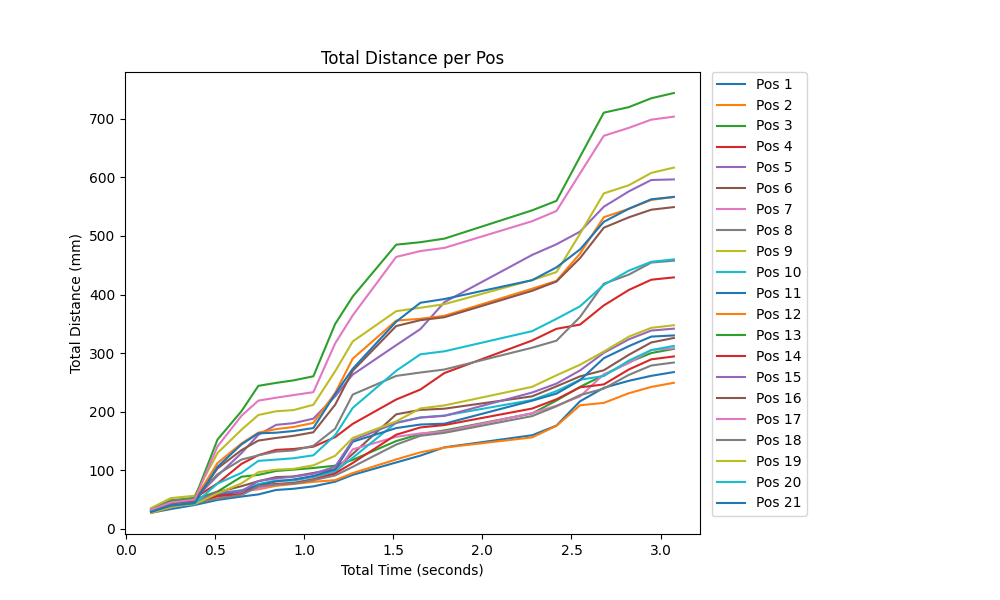
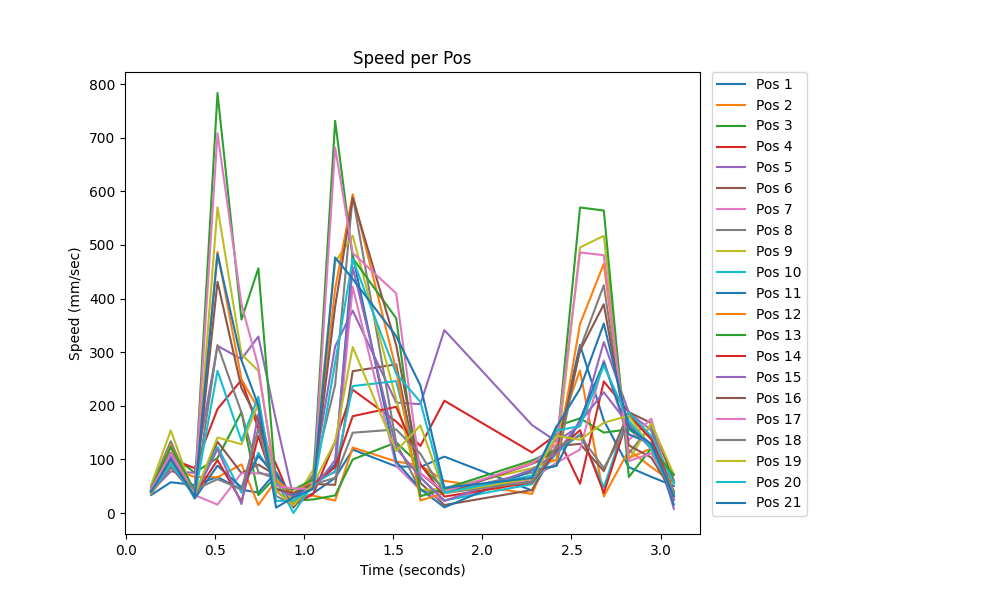
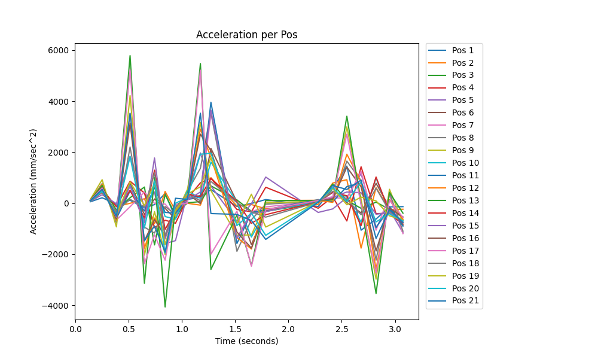
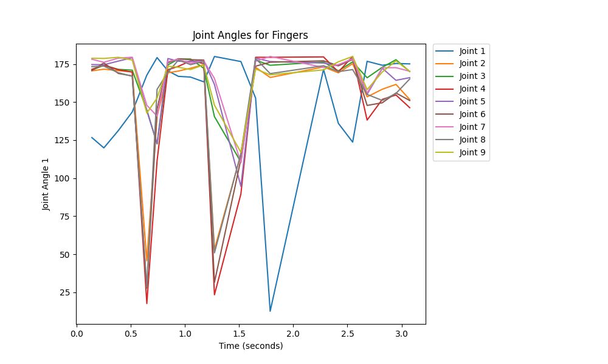
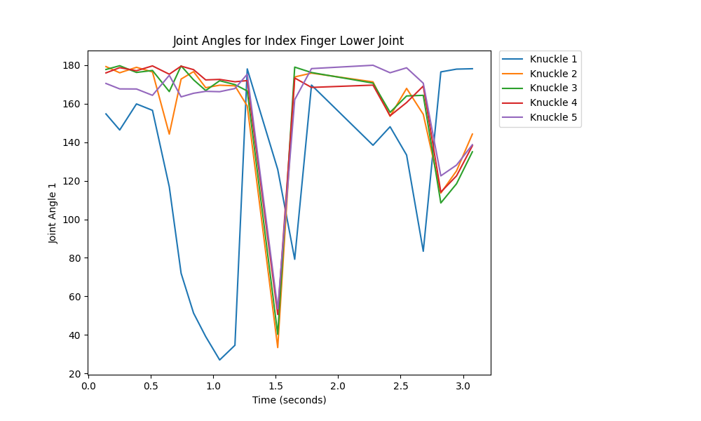
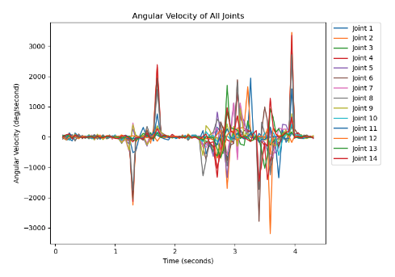
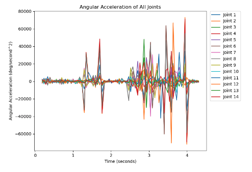
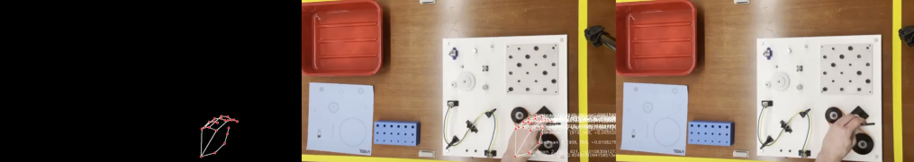

# MediaPipe Hands: Hand Exoskeleton Evaluation

Based on the MediaPipe Hands landmark detection that exists, we added our own evaluation metrics, which include: total distance, speed, and acceleration per landmark as well as joint angle, angular velocity, and angular acceleration. 

## Table of Contents

- [Features](#features)
- [Getting Started](#getting-started)
  - [Prerequisites](#prerequisites)
  - [Installation](#installation)
- [Usage](#usage)
- [Acknowledgments](#acknowledgments)

## Features

Currently, the script allows for the evaluation of two hands (left and right). Each hand is evaluated independently, and the following outputs will be generated for each.

Per landmark:
- Position coordinates over time (.csv)
- Distance over time (.csv) and total distance plot (.png)


- Speed over time (.csv) and speed plot (.png)


- Acceleration over time (.csv) and acceleration plot (.png)



Per joint:
- Angle positions over time (.csv) and angle plot (.png)



- Angular velocity over time (.csv) and angular velocity plot (.png)


- Angle acceleration over time (.csv) and angular acceleration plot (.png)


In addition, the following videos (.mp4) will be generated:
- Normal video of recording
- Superimposed video with landmarks and velocity vectors
- Abstract video with black background and only landmarks & velocity vectors
- Side-by-side comparison of three previously mentioned videos


## Getting Started

### Prerequisites

In order to run the program, python needs to be installed on the machine.

### Installation

In order to install all the necessary dependencies, please run [Install.sh](Install.sh).

Disclaimer: to make the shell script executable, please run the following command: 

```chmod +x Install.sh```

To execute the script, run the following command: 

```./Install.sh```

## Usage

After installing all dependencies, please run the following command: 

```python capture.py```

The user will have the option of running the algorithm on live video feed or on a video file.
## Acknowledgments

We would like to thank our advisor Dr. Mili Shah, The Cooper Union, and NIST for their support.
